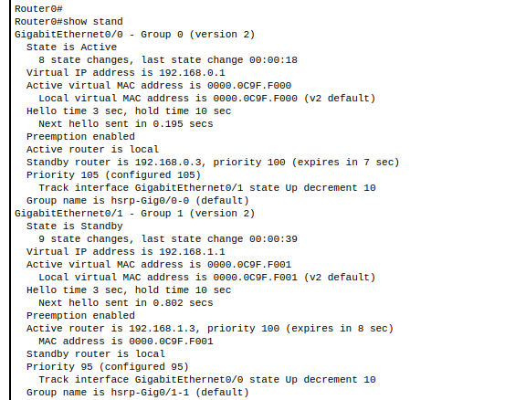
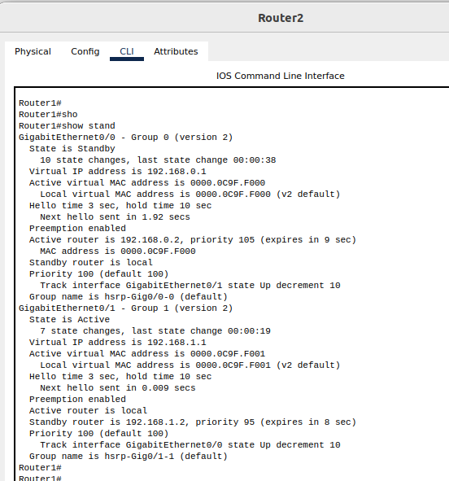
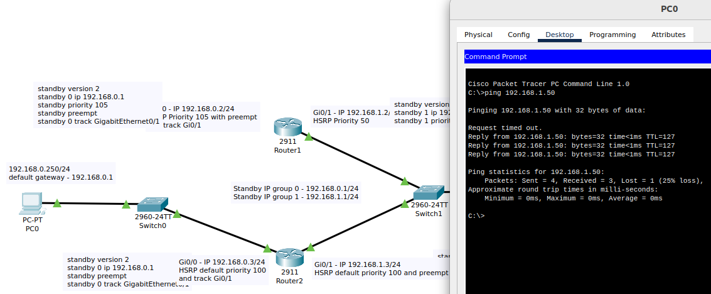
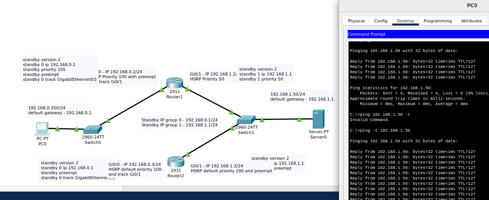
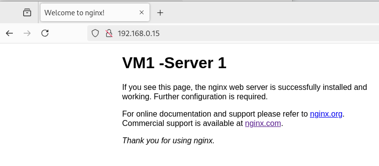
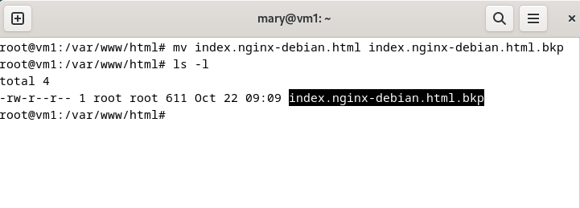
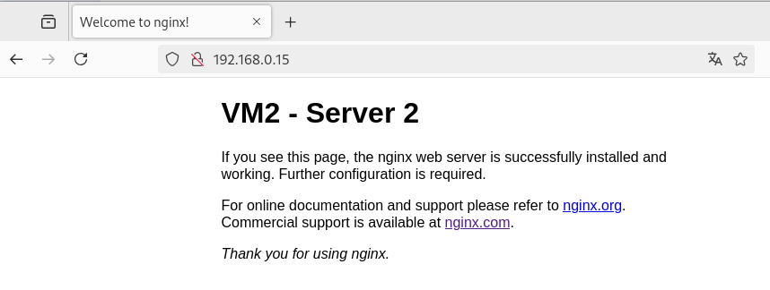
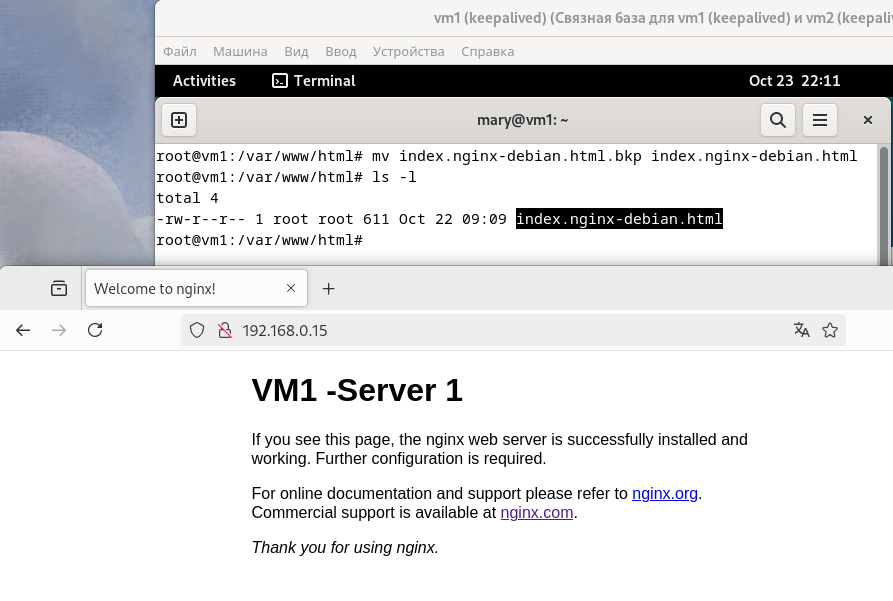
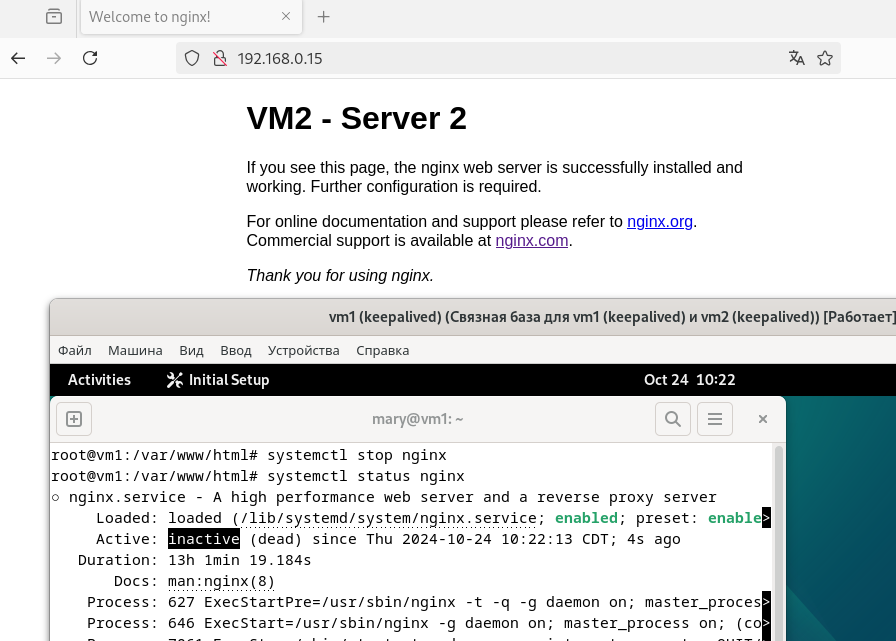

# Домашнее задание к занятию "Disaster recovery и Keepalived" - Варфоломеева Марьяна

### Задание 1

В Packet Tracer настроить отслеживание состояния интерфейсов Gi0/0 (для первой группы).

На Router1 на Gi0/1 нужно включить preemption и настроить отслежвание за инт. Gi0/0

```
> en
> conf t
> int GigabitEthernet0/1
> standby preempt 
> standby 1 track GigabitEthernet0/0
```

Вообще, в команде track я пробовала задать величину, на которую будет уменьшаться приоритет у Gig0/1, если отвалится Gig0/0
Но так как выходила ошибка с decrement, я изменила приоритет c 50 до 95. 
```
> standby 1 priority 95
```


На Router2 необходимо только включить отслеживание
```
> en
> conf t
> int GigabitEthernet0/1
> standby 1 track GigabitEthernet0/0
```


Результат работы  после настроек HSRP:




### Задание 2

Настроить Keepalived так, чтобы он запускал скрипт проверки доступности веб-сервера и существования 
index.html каждые 3 секунды, и переносил виртуальный IP на другой сервер, если скрипт завершится с кодом,
отличным от нуля (то есть порт веб-сервера был недоступен или отсутствовал index.html). 
Используйте для этого секцию vrrp_script

Для выполнения задания были запущены 2 виртуальные машины с ОС debian: vm1 и vm2
На обеих машинах  установлены keepalived и nginx

 - Bash-скрипт [check_nginx](./files/check_nginx), который проверяет доступность порта nginx и 
существование файла index.html.

 - Конфигурационный файл для vm1 (Master) [keepalived.conf](./files/keepalived.conf)

 - Конфигурационный файл для vm2 (Backup) [keepalived.conf](./files/keepalived.conf.bkp)


keepalilved назначает вирт. адрес  192.168.0.15 серверу с большим приоритетом.
В штатной ситуации адрес 192.168.0.15 назначается серверу vm1 (master-server )


Теперь переименуем на vm1 файл index.html:


Проверим адрес 192.168.0.15. Видим, что вирт. адрес переназначился на vm2 (backup-server):


Переименуем файл обратно и получим снова vm1 на адресе 192.168.0.15:


То же самое произойдет, если  остановить сервис nginx на vm1



